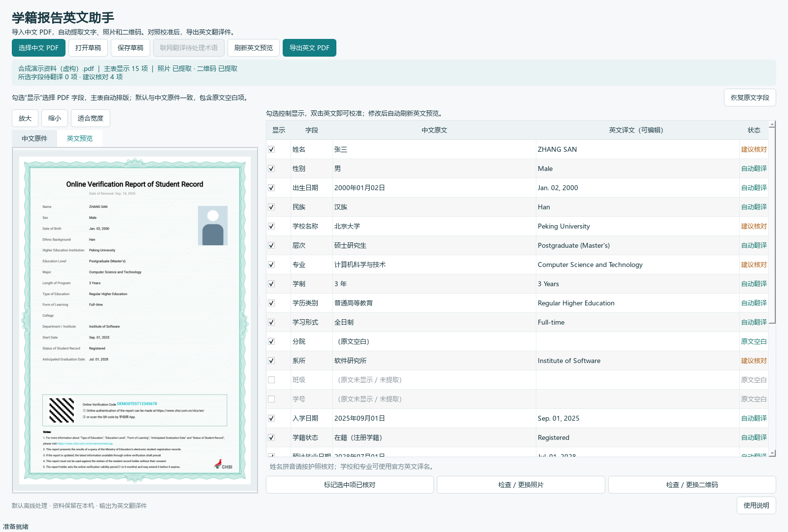

# 学籍报告英文助手 / CHSI PDF Translator

把学信网直接下载的中文《教育部学籍在线验证报告》PDF 转为可校准的英文翻译件。
不需要填写 YAML、输入 API Key 或手动截图照片。Windows 版安装后无需 Python。

**当前版本：1.2.0 · Windows 10 / 11 x64 · Python 3.10+ · Apache-2.0**

## 下载与文档

普通用户请前往 [Releases 下载页](https://github.com/haoyanan2024/chsi-pdf-translator/releases/latest)，展开 **Assets**，下载 `CHSI-Translator-Setup-1.2.0.exe`。这是可安装的软件；页面自动提供的 `Source code (zip)` 是源码，不能直接双击运行。

| 你想做什么 | 对应文档 |
| --- | --- |
| 安装软件、导入 PDF、校准英文、控制字段和导出 | [详细操作指南](docs/USER_GUIDE.md) |
| 解决识别、排版、安装或导出问题 | [常见问题](docs/USER_GUIDE.md#常见问题) |
| 运行 Python、使用命令行/API、打包 Windows 软件 | [开发与构建指南](docs/DEVELOPMENT.md) |
| 上传源码、发布 EXE、维护后续版本 | [GitHub 发布完整流程](docs/PUBLISHING.md) |
| 查看版本变化、实测范围、参与改进 | [更新记录](CHANGELOG.md) · [验证记录](VALIDATION.md) · [贡献指南](CONTRIBUTING.md) |



*图中的姓名、照片、验证码和二维码图案均为合成演示资料，不对应真实报告。*

## 普通用户使用

1. 双击 `CHSI-Translator-Setup-1.2.0.exe`，按安装向导完成安装。
2. 打开“学籍报告英文助手”，点击“选择中文 PDF”，也可以拖入 PDF。
3. 软件自动提取中文字段、原证件照、原二维码和验证码，并进行本地翻译。
4. 默认显示中文原件所有已识别字段（含空白行），分院、系所直接排进主表。在“显示”列逐项勾选，或点击“恢复原文字段”。
5. 双击英文单元格校准，勾选和修改后自动刷新英文预览。姓名按护照拼写核对，学校、专业以正式译名为准。
6. 点击“导出英文 PDF”选择保存位置。

“保存草稿”保留译文、显示选择、图片和中文预览，下次打开 `.chsi.json` 即可继续编辑，不必重新导入。
打开旧版草稿会保留译文，并改为按中文原件显示字段；旧的附页选项不再使用。
预览支持放大、缩小和适合宽度。可检查或更换自动提取的照片及二维码。
安装范围为当前用户；从 Windows 设置的“已安装的应用”中卸载即可。

## 已实现

- PDF 文字层按字段和坐标提取，保留原文供逐项核对。
- 自动提取嵌入的照片、二维码；优先使用原始位图，不重新生成二维码。
- 本地姓名拼音、日期转换、教育层次、学籍状态、学习形式及常见学校/专业术语翻译。
- 逐项英文校准、状态标记、草稿保存与恢复、中文/英文预览。
- 未收录的学校、专业、院系可手动翻译，或点击“联网翻译待处理术语”使用 MyMemory，无需配置密钥。
- 保留参考项目 `online_verification_report_template20260809.pdf` 的花边、底纹、标题、照片/核验区域和 Roboto 字体。
- 主表自适应排版：默认按中文原件的字段及顺序显示，分院、系所、班级、学号等直接排在主表中，不再生成附页。
- 每项信息可独立显示或隐藏，标签、译文与行距同步更新；隐藏不会丢失草稿中的原文和译文。
- 原文未出现的常用字段默认不勾选，需要时可勾选并填写英文。支持一键恢复与原文一致的字段选择。
- 日期格式与参考项目一致，例如 `Sep. 18, 2026`；原文未写失效日期时不推算或添加日期。
- 中文原文空白的字段默认保留标签和值的空白；注意事项按原文翻译，可手动校准或逐项取消显示。
- 图形界面和命令行、Windows 应用构建脚本、Inno Setup 安装包脚本、GitHub Actions 构建流程。

## 适用范围与限制

- 输入应为学信网直接下载、包含文字层的中文《教育部学籍在线验证报告》PDF。目前不支持扫描件、截图、学历或学位类报告，也不提供批量转换。

## 支持范围和限制

- 主要支持学信网原始下载、带文字层的中文**学籍在线验证报告**及相近单列布局。
- 扫描件、截图 PDF、学历证书电子注册备案表、学位报告不在当前识别范围；软件会提示，不做猜测。
- 同一个 PDF 中包含多份学籍报告时拒绝导入，避免混合不同人的资料。
- 版式变体或字段缺失会给出提示。所提供的真实样本和合成测试已通过验证；没有声称覆盖全部历史版式。
- 本地词库并不覆盖所有学校、专业和民族；未收录项保留为待处理状态，不生成虚构译名。
- 人名多音字、少数民族姓名、复姓、音译和学校官方英文名称均应校准。
- 联网服务有免费配额及可用性限制；失败时可以继续手动校准。联网适配器通过模拟服务测试，默认流程不依赖它。
- 根据字段数与译文长度自动换行、调整行距，必要时适度缩小字号，避免遮挡照片、花边和核验区域。内容仍超过单页空间时提示缩短译文或隐藏部分字段，不截断内容。
- 界面、文档和 PDF 元数据说明输出为翻译件。核验码指向中文原件，输出不是学信网官方签发的英文报告。
- Windows 10 / 11 x64 为本版本目标平台；本次实测为当前 Windows 主机，未完成所有系统版本的矩阵测试。
- 本地交付的 EXE 未购买代码签名证书；系统可能显示“未知发布者”。源码和 SHA-256 校验文件一并提供。

## 隐私

默认不联网，不上传 PDF、照片、姓名或验证码，不进行遥测，不自动写入含个人信息的日志。
点击可选联网按钮后，软件会列出拟发送的学校、专业或院系术语，经确认后发送给 MyMemory。
保存的草稿包含完整个人信息和图片，应当与原 PDF 一样妥善保管。

公开源码压缩包使用文件白名单构建，不含用户 PDF、照片、真实草稿、虚拟环境和本地输出。
`private/`、`dist/`、`release/` 及报告文件均已列入 `.gitignore`。

## 源码运行

需要 Python 3.10+（Windows 发布构建使用 Python 3.12 x64）。在项目目录执行：

```powershell
python -m venv .venv
.\.venv\Scripts\python.exe -m pip install -r requirements-build.lock
.\.venv\Scripts\python.exe run_app.py
```

也可以在独立环境 `pip install ".[gui]"` 后运行 `chsi-translator`。

Linux 服务器不需要安装 GUI 依赖或图形桌面：

```bash
python3 -m venv .venv
.venv/bin/python -m pip install ".[test]"
.venv/bin/python -m pytest -q
.venv/bin/python -m chsi_translator --self-test --headless
.venv/bin/python -m chsi_translator "中文报告.pdf" --output "English.pdf"
```

Python API：

```python
from chsi_translator.extract import extract_report
from chsi_translator.export import export_pdf

report = extract_report("中文报告.pdf")
# 可选校准；无需填写配置文件或提供图片。
report.get("name").translated = "ZHANG SAN"
# 可选：隐藏某项，不丢失原始数据。
# report.get("college").visible = False
export_pdf(report, "English.pdf")
```

命令行直接转换（同样默认离线，不会覆盖输入原件）：

```powershell
.\.venv\Scripts\python.exe -m chsi_translator "中文报告.pdf" --output "English.pdf" --save-draft "校准.chsi.json"
.\.venv\Scripts\python.exe -m chsi_translator --draft "校准.chsi.json" --output "English-reviewed.pdf"
```

命令行也可控制字段，例如 `--hide college --hide department`。`--show student_id` 可显示原文未出现的常用项；需要非空内容时先在界面或草稿中填入译文。`--hide`、`--show` 均可重复使用，草稿会保存选择。

已勾选的待翻译字段会阻止导出；隐藏的字段不阻止导出，也不参加可选联网翻译。安装后的无控制台 EXE 供普通用户双击使用。

## 开发与构建

```powershell
.\.venv\Scripts\python.exe -m pytest -q
.\.venv\Scripts\python.exe -m chsi_translator --self-test
powershell -ExecutionPolicy Bypass -File scripts\build_windows.ps1 -InnoCompiler "C:\Program Files (x86)\Inno Setup 6\ISCC.exe"
```

构建脚本依次校验依赖许可证、运行测试、生成 PyInstaller 目录式程序、运行冻结程序自检、调用 Inno Setup。
安装器使用 `PrivilegesRequired=lowest`，支持选择目录、开始菜单/桌面快捷方式和标准卸载。
Qt DLL 保留为独立动态库。构建输出在 `release/`。
构建脚本会隔离 DLL 搜索路径，防止本机 Poppler、Conda 等工具的同名 ICU 库混入安装包。

`scripts/package_source.py` 生成可公开的源码 ZIP 和发布文件 SHA-256 清单。
发布前可将仓库上传到 GitHub；推送 `v1.2.0` 标签会触发附带的 Windows 构建工作流。
该工作流只提供构建产物，不自动创建或覆盖 Release。将本地已验证的 EXE、源码 ZIP 和校验清单发布到 Releases，具体步骤见 [发布指南](docs/PUBLISHING.md)。

代码结构：

```text
chsi_translator/
  extract.py       PDF 识别、字段/图片提取
  translate.py     离线规则、拼音、可选网络适配器
  model.py         数据模型和版本化草稿
  export.py        保留模板背景的字段自适应排版
  gui.py           中文对照校准界面
  selftest.py      无真实个人信息的端到端自检
  data/glossary.json  可扩展词库
  data/report_template.pdf  清理隐含示例资料后的原版式模板
  data/fonts/      原项目配套 Roboto 字体
tests/            合成 PDF 回归测试
scripts/          构建、打包、许可证收集
installer/        Inno Setup 配置
```

扩展学校/专业词库只需修改 `data/glossary.json`。提交新布局支持时，请提供虚构或充分脱敏的测试样本。
请勿提交真实报告、照片、二维码或学籍号码。

## 参考与许可

复用 [muxiymmm 的原项目](https://github.com/muxiymmm/Online-Verification-Report-Translator20260714) 的模板、Roboto 字体及填充坐标，将手工配置和截图替换为自动 PDF 提取与桌面校准。
原模板隐藏图层中仍有示例个人资料；本版已移除示例文字、照片、二维码资源，清理前后渲染逐像素一致。源码包含清理脚本、版本与资源来源记录，见 `chsi_translator/data/TEMPLATE_PROVENANCE.md`。

本项目代码以 Apache-2.0 开源；见 `LICENSE`、`NOTICE` 和 `THIRD_PARTY_NOTICES.md`。
学校词库为参考译名，例如 [中国科学院大学官方资料](https://admission.ucas.ac.cn/Content/Upload/2019/4/1.pdf)。
界面允许校准，不把词库视为官方英文验证结果。
